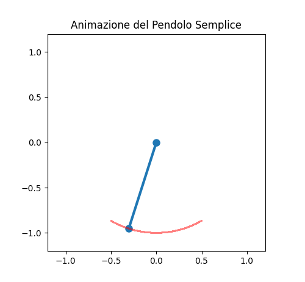

# simple_pendulum
Questa è una simulazione di un pendolo semplice scritta in python. Nella repository si può trovare il codice sorgente e un'immagine di un fotogramma della simulazione.

#Risultati Grafici
Il codice permette una visualizzazione video del pendolo, ecco un fotogramma:

